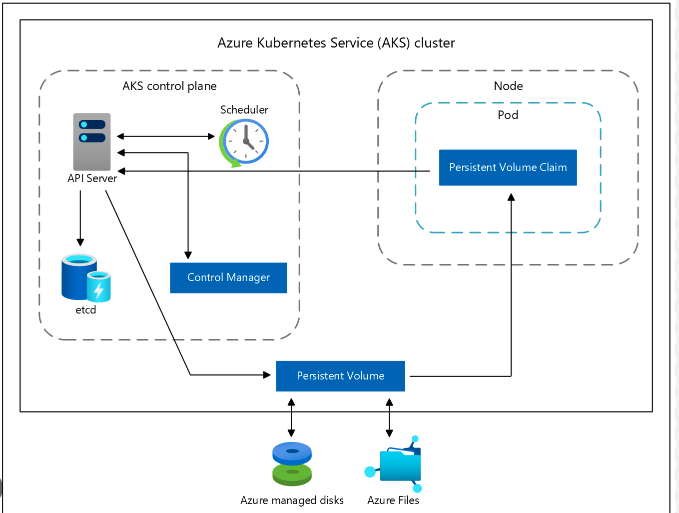

## Azure 101

### Cost Reduction

CPU utilization can be monitored via different tools like NewRelic and Azure Portal.

#### How to check these logs?

TODO

#### Related Articles

- FinOps Framework: https://www.finops.org/framework/

### Cloud Architecture

#### Related Articles

- Well-Architected Framework: https://learn.microsoft.com/en-us/azure/well-architected/

### Modules

#### Compute Infrastructure

##### Virtual Machines

VMs comes with different types and features, one example is: ***Standard_F2s_v2***
with 2 vCPUs and 4GB memory, 16 GB temp storage (local), max 4 attachable Remote Storages.

The ***Fsv2 Series*** within family ***F Family*** comes with multiple features like:
- Live Migration - basically maintenance / upgrade without reboot
- Ephemeral OS Disk - uses local storage for the OS
- ... many more ...


##### Virtual Machine Scale Set (VMSS)

These are virtual machines (in a set) typically initiated by an AKS cluster.

To get the Disks click on the following in Azure Portal:
```
Virtual Machines ➡️[Set Name] ➡️ Settings ➡️ Disks

OS disk
AKSUbuntu // VM uses it to boot, does not show in the Storage center - Azure Disks

Data disks
N/A
```
To check the Instance disks:

```
Virtual Machines ➡️ [Set Name] ➡️ Instances ➡️ [Instance Name] ➡️ Settings ➡️ Disks

OS disk
aks-default-[XYZ]-OS-[XYZ]

Data disks
N/A
```

Not every kind of disk is displayed here as the ***Local Storage*** not appears here only
the ***OS Disk*** and the attached ***Remote Storages***.

##### VM Storage Types

- See [Azure Disk Types](#azure-disks)

#### Storage Center

##### Azure Disks

- Temporary Disk (Local Storage)
  - Not persistent
  - Short-term storage for apps and processes
- Data disk (Remote Storage)
  - Managed disk attached to the VM to store the application data
  - Persistent / Long-term
- OS Disk
  - Persistent storage for the OS
  - For cost saving can be used to store app data

How do ***Kubernetes*** maps ***Persistent Volume Claim*** to Disks?



What happens if I define an ***emptyDir*** in Kubernetes as a volume?

```
This volume typically uses the underlying local node disk storage.
Data written to this volume type persists only for the lifespan of the pod.
```
###### Related Articles

- https://learn.microsoft.com/en-us/azure/aks/concepts-storage

