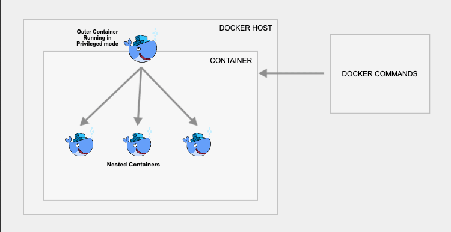

## Dcoker 101

### Docker outside of Docker (DooD) using unix socket

What is a unix socket?
```
Sockets are meant for communication between processes on the same host. 
The docker daemon listens on socket: docker.sock
```

We can query the docker-engine version by running:
```
curl --unix-socket /var/run/docker.sock http://localhost/version
```

Creating a docker container inside the host's docker-engine (<span style="color: #ff6b6b;">this will not create a docker daemon inside the host's docker-engine</span>),
by mounting the host docker-engine socket:
```
docker run -v /var/run/docker.sock:/var/run/docker.sock -ti docker
```

This way when we are executing the docker commands from within the container, we are instructing the docker client to connect to the VM host docker-engine through docker.sock

### Docker in Docker Using DinD

Creating a docker container inside the host's docker engine (<span style="color: #6bb6ff;">this will create a docker daemon inside the host's docker-engine</span>):
```
docker run --privileged -d --name dind-test docker:dind
```

This way inner daemon stores images/containers inside the container.

Everything—images, containers, layers—goes into the container's own filesystem.
This means if the container is deleted, its Docker data is also deleted.

Diagram:



### Trade-Offs

#### Use DooD

- You want speed and Docker cache reuse

### Use DinD

- When full isolation is needed (e.g.: CI/CD)
- You want a self-contained Docker environment
